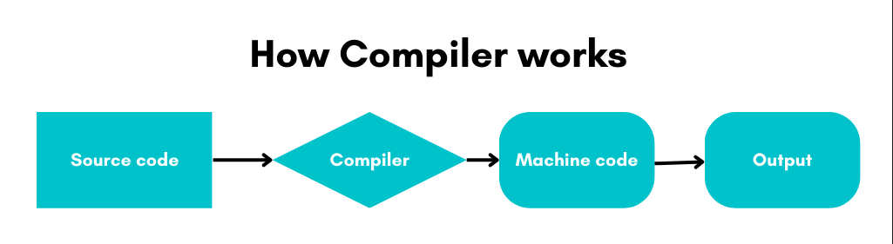

# Programming Concepts

## Programming
In basic terms, programming is the process of creating a set of instructions that instructs the computer to perform a task. Consider an example where you input two values and want to find the sum of them. The two values are stored as variables value1 and value2. They are then added using the + operator and the result is stored in the result variable.

Step 1: Create variables as value1, value2, and result to store the values.
Step 2: Take the input for value1 and value2 from the user.
Step 3: result = value1 + value2.
Step 4: Print the result.

The result is now displayed. The above example is the set of instructions given to a computer to add two numbers. The instructions will be given in the form of a program. The art of writing a program is called programming.

## Programmer
In basic terms, programming is the process of creating a set of instructions that instructs the computer to perform a task. Consider an example where you input two values and want to find the sum of them. The two values are stored as variables value1 and value2. They are then added using the + operator and the result is stored in the result variable.

## Machine language
As humans, we are equipped with the ability to learn multiple languages. Sadly, computers don't have that ability. They are designed in a way to read 0s and 1s (these 0 and 1 are called binaries). Yes, you are right. Computers convert everything we input as 0s and 1s and that's what we call a machine language (here, instructions to the computer will be given using binaries). 
But imagine instructing a computer to design a website just by inputting 0s and 1s. It's impossible for a human to do that, right? So, we designed several high-level programmer-friendly languages which can be converted in a way that the computer can understand. How do they convert? We will be covering them shortly.

  

Here, a machine language is described as a language that is understood by a computer. It is very difficult to understand for humans, but it is the only thing that the computer can work with. All programs and programming languages eventually get converted and run as machine language, behind the scenes.

## Programming language
Now, how does the same programmer develop and execute a specified task where he or she needs to communicate with a computer that doesn't speak our human language? So, instead of computer learning English, it's humans who have to learn the computer language, which is called a programming language.
Here, a programming language is described as a specific language in which a programmer is expected to solve a specific task.

## High-level to machine level conversion
A high-level programming language is a programming language that is designed to be easily understood and used by humans. It is quoted as high-level because it is closer to human language and abstracts away many of the details of the underlying hardware. Examples of high-level languages include Python, Java, C++, and C#.

Machine language, on the other hand, is a low-level programming language that is executed directly by the computer's hardware. It consists of binary code, which is a series of 0s and 1s that the computer's processor can understand.

To convert any program written in a high-level language to machine language, a compiler or interpreter is used.

It's important to note that high-level programming languages have many features that make development faster and more efficient, but the final code executed by the computer is always in a machine-level language.

  
## Compiler
  
In our scenario, our programmer has the knowledge of creating a program in an environment which includes a compiler. It's the compiler's job to convert human-readable code to machine-readable code for the computer to execute the program.
  

In basic terms, a compiler is a program that takes the source code written in a high-level language and converts it into machine code. This machine code can then be executed directly by the computer's processor.
  
## Interpreter
  
If the compiler can convert the high-level language to machine-level language, then what is the role of the interpreter? To understand it, we need to analyse why there is a need for a compiler and interpreter. A compiled program runs faster than an interpreted program but the interpreter directly runs and executes the high-level language without converting it into machine-level language.

 
While some prefer a compiler over an interpreter for its efficiency and faster execution, it has a specific target and cannot be used cross-platform. i.e., the compiler can generate the machine language instructions based on its target platform or operating system in which the program will run. The machine language instructions generated for Windows Operating System will not run in the Linux Operating system. The program has to be recompiled in the Linux environment to make it work. This issue is called portability issue. To solve this portability issue, an interpreter is used.

In short, an interpreter runs and executes the high-level code directly line by line, instead of converting it to machine language first.

## Programming structure
The next thing a programmer has to work on is the programming structure which is also described as the program layout. This includes indentation, commenting, and the use of functions and modules.
A well-structured program is easy to read, understand and modify, while a poorly structured program can be difficult to work with. Good programming practices, such as using meaningful variable names and commenting, can also contribute to the overall structure of a program.

## Programming logic
Along with the program structure, the programmer needs to crack the problem logic to get the desired output or result. In this case, he/she needs to provide the right programming logic to build the website based on the user's needs.
Programming logic can be described as a set of principles that aligns the elements in a logical way for the computer to perform required tasks and get the output.

## Procedural programming
Let's consider a scenario. As a customer support person for a regional bank, I want to be able to input a customer's account information to withdraw or deposit money from their account, so that I can properly assist the customer with their financial transactions. 

This can be accomplished using a procedural programming approach, in which the program is broken down into a series of specific steps or procedures that are executed in a specific order. Here the program is built with a series of steps/instructions.

## Functional programming
   
Functional programming is an approach used to organise a set of codes as a function. It is a way of modularization in software programming. The functions are key in the functional programming approach where functions will receive inputs and return an output without having any side effects on the inputs given. Here the program is built by applying and composing functions.
Basically, the function isolates a set of tasks otherwise required by the programmer to implement. Being a programmer in the functional programming approach should know how to use the function by passing the input and getting the output. This is like mathematical functions where it will have the output for the given inputs, without impacting the current program. 
For example, if we want to convert Fahrenheit to Celsius, we should know how to pass the Fahrenheit value as input and expect the Celsius value as output, without knowing or analysing how the conversion happens. This gives a certain level of abstraction when we use third-party functions. 

## Object-oriented programming
Now that we have seen programs that are processed based on functions and procedures, we also have programs that run based on objects. Yes, they are more detail-oriented and help in data security and integrity.
In the programming world, we define it as a paradigm that is based on the concept of "objects", which are self-contained units of data and functionality. In OOP, objects are created from classes, which define their properties and methods. Objects can interact with each other by sending messages (method calls) and can change their internal state as a result.
OOP is commonly used in many programming languages like Java, C++, Python, C#, etc. OOP is useful for modelling real-world objects and systems, and for creating reusable and maintainable code.

   
### Abstraction
   

   
Imagine a scenario where we all use an ATM machine for cash withdrawals, money transfers, retrieve mini-statement, and so on in our daily life. But we don't know what internally happens inside an ATM machine when you insert an ATM card for performing any kind of operation. This is a very basic explanation of what abstraction is.
In other words, Abstraction is a technique by which we can hide the data and processes that are not required by a user.

There are 2 ways to achieve abstraction in Java. They are as follows:
1.	Abstract class (0 to 100%)
2.	Interface (100%)

Advantages of abstraction:
1.	It reduces the complexity of code readability.
2.	It removes code duplication and enhances reusability.
3.	It helps to improve the security of an application or program as only important details are provided to the user.
4.	Abstract method can be implemented to perform different tasks depending on the needs.

   
### Encapsulation
For the same ATM machine scenario, can we break open the machine just like that? No. The protective shield-like structure in the machine prevents money from being stolen and that is what we call Encapsulation. It is defined as wrapping up of data into a single unit which in this case refers to the money inside the ATM machine.

Encapsulation can be achieved in the following ways:
1.	Declaring the instance variable of the class as private, so that, it can't be accessed directly from outside the class.
2.	Assign the public setter and getter methods in the class to modify the values of the variables.

Advantages of encapsulation:
1.	The encapsulated code is more coherent and easier to change with the latest demands.
2.	It prevents other classes to gain access to private components.
3.	It enhances the maintainability of the application.
4.	It helps in achieving security.
  
   
### Inheritance
Let's consider a scenario. Suppose a bank wants to open a new ATM branch and set up a new ATM machine. It's always easier to inherit the existing code and implement it in the new machine. In this way, we can be quicker and more efficient. 
In other words, Inheritance is the mechanism by which an object acquires some/all properties of another object.

Why use Inheritance?
1.	For Method Overriding (so runtime polymorphism can be achieved).
2.	For Code Reusability.

Types of Inheritance:
1.	Single inheritance
2.	Multiple inheritance
3.	Multi-level inheritance
4.	Hierarchical Inheritance
5.	Hybrid Inheritance

### Polymorphism
To continue with our scenario, we can perform multiple operations on an ATM machine like cash withdrawal, cash deposit, PIN generation, Balance check, etc. It refers to the ability of an entity to perform multiple tasks while having the same name.

Polymorphism is of two types:
1.	Compile-time polymorphism (Method Overloading): When there are multiple functions with the same name but different parameters, then these functions are said to be overloaded.
2.	Run-time polymorphism (Method Overriding): It occurs when a derived class has a definition for one of the member functions of the base class. That base function is said to be overridden.

## Top-down apporach vs Bottom-up approach
   
In our scenario, the top-down approach to management is a strategy in which the decision-making process occurs at the highest level and is then communicated to the rest of the team. This style can be applied at the project, team, or even at the company level, and can be adjusted according to the group’s needs.
When approaching project objectives from the bottom-up approach, a team will collaborate across all levels to determine what steps need to be taken to achieve overall goals. The bottom-up approach is newer and more flexible than the more formal top-down strategy, which is why it’s more commonly found in industries where disruption and innovation are a priority.

   
| Top-Down Apporach                                                      | Bottom-Up Approach                                                        |
|------------------------------------------------------------------------|---------------------------------------------------------------------------|
| It is decision driven                                                  | It is data driven                                                         |
| Focuses on functions                                                   | Focuses on data                                                           |
| Can contain redundancy as the problem is broken down into sub problems | Can contain less redundancy as data is hidden and secured                 |
| Mostly used by procedural programming languages like C, Fortran, etc.  | Mostly used by Object oriented programming languages like C++, Java, etc. |  
   
For more information, visit,
   1. https://developer.mozilla.org/en-US/docs/Learn/JavaScript/Objects/Object-oriented_programming
   2. https://docs.oracle.com/javase/tutorial/java/concepts/index.html
