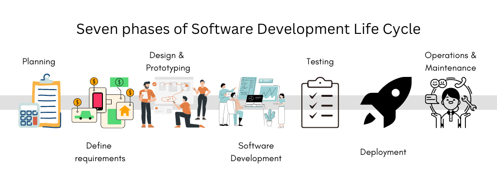
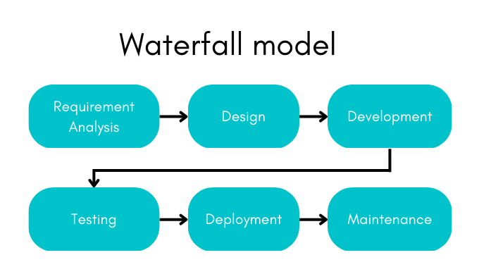
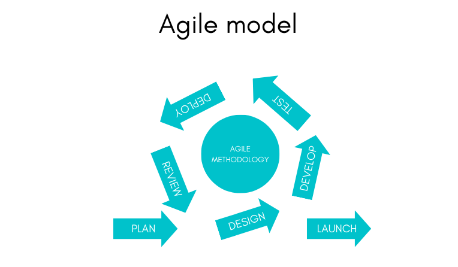

# SDLC and Agile Fundamentals 

    

 ## Introduction to SDLC 

Let’s start introducing you to SDLC with a packet of Biscuits. Yes, you heard that right. As we have a biscuit, we tend to wonder how it is being manufactured, and what are the stages in the manufacturing process and that is what we are going to dive deep into.

Firstly, there will be the ingredients preparation stage, which includes measuring and mixing the ingredients (flour, sugar, butter, eggs, etc.).

Then, Dough making process, where the prepared ingredients are mixed to form a dough.

Then, the Dough shaping and cutting process, where the dough is shaped into the desired biscuit shape and cut into individual biscuits.

Then, the Baking stage, where the biscuits are baked in an oven until they are golden brown.

Finally, the Cooling and packing stage, where the biscuits are cooled and then packed for distribution and sale.

And this is how we receive our biscuit packet, and we enjoy having it. Don't we?

Similarly, we have different stages involved in building software applications, just like our biscuits and we call them Software Development Life Cycle or SDLC.

SDLC is a business practice to analyse, build, deploy and maintain software applications as it helps to increase the efficiency and quality of the team who develop the software and the quality of the software being developed as well as to meet customer expectations.

## Overview of Software Development Life Cycle  

Organizations use a certain process to provide structure to their employees for doing certain things, effectively. This process provides an effective plan including various activities, dependencies and other required resources such as other employees etc.  It’s also applicable in the software development life cycle (SDLC), where there will be a defined and refined process, dependencies and required resources listed and planned.

Various people in the organization are involved to develop software applications, such as business analysts, developers, and software engineers., etc. SDLC is very much useful as it helps to create effective structure, plan, innovate and continuously improve the products, and collaborate across various development stages and teams.

 

 

## The 7 stages of SDLC: 

  

### Planning 

In this phase, the primary task is to clearly define the scope and objective of the software application. They also define the resources and materials needed and set limits to prevent the project from deviating from its initial objective. The High-level management team will plan the purpose of the application based on the need and then work out high-level budget planning with return-on-investment on this software application.

For example, collecting requirements to build a software application like teams or google meet.

### Define Requirements 

In this phase, the team refines the features/functionalities that they want in the software application to deliver to its users. The end users of the applications will be involved along with the project team and go through the SDLC to develop the required software. The business analyst will take a lead role to define the requirements.

Here, all the stakeholders (the people who are involved in the design, development and delivery, and also the users who will benefit from the software application) will define the functional requirements and non-functional (such as the speed in which the system has to respond to the user etc.) requirements based on the business and users.

For example, a video conferencing tool/application needs below high-level functionalities.
•	Users to connect and chat.
•	Users to connect and have video conferencing.
•	Users to share files and data, etc.

Examples of non-functional requirements can be,
•	There should not be any lagging when other users are talking.
•	Tool should work even when there is slow internet connectivity.

### Design & Prototyping 

In this design and prototyping phase, the team visualises or sketches the application’s look and feel that will attract the end users and will have a very easy-to-use approach. The technical team will design the application architecture, its integration approach/design with other systems and so on. Architects and UI/UX will take lead roles during this stage.

Some of the artifacts produced from this phase are an architecture diagram, user interface, application security and deployment diagram etc.

For example, for the video conferencing tool, the UI/UX designers may design a look and feel that will be very simple to use by the end users. The technical team such as the architect may design the application and/or system architecture.

### Software Development 

This is the phase where the actual development of the software happens. The development team comprises various technical developers whose work is put together to implement the functionalities scoped, through the code. 

Various Industry standards and quality criteria will be set to ensure that the code is manageable, maintainable, and enhanceable later. Developers and Technical resources will be key during this phase.

For example, here the developers started developing functionality to provide chat features for the users of the tool just like teams.

### Testing 

The testing phase is crucial to identify and it correct the errors and bugs that can occur. The testers or quality analysts will validate the system features delivered by the development team against the functional requirements given by the Business Analysts. If possible, they will validate the non-functional requirements also.

The testers will report the issues through an excel sheet or through the bug-management system and the developers will act on the ticket/issues to fix the bug and release it again for testing. This cycle will happen until the bug/issue is resolved.

The testing team will also report the issues’ status to the management team and other stakeholders who are relevant to this application. 

If the end users are invited to test the application, it is called as User Acceptance Testing (UAT).

For example, a team of testers can validate the chat features developed and delivered by the development team.

### Deployment 

In the deployment phase, the software application will be installed in the physical or virtual hardware to provide a fully working application to the end users. The deployment will be done by specialized people who are experts in Operating systems, networks, infra management and so on. In recent days, this deployment is part of the developers’ responsibility and is called as DevOps process. 

There are ways to deploy the software application to the target platform/environment so that the application will be available for users to access. Deployment can be done by technical people manually or by setting up a one-time automated process.

For example, the well-tested chat feature is deployed into the hardware/cloud environment so that the end users can start using it.

### Operations & Maintenance 

In this phase, the software application is almost completed and available to the end users to use. During usage, the application may have some issues that might be reported by the users of the application and then the issue is to be fixed immediately and the application is updated. Or during the system usage, the users may ask for some more features or small enhancements to the existing features and this also will be prioritised based on the users’ demand and it is developed and deployed with the existing software application.

For example, the continuous and updated functions/features released by chat tools like Teams.

<!-- UL --> 

## Advantages of SDLC 

*	Increased visibility and collaboration to design and create software applications. 

*	Reduced time and costs as requirements and functionality are prioritized. 

*	Increased clarity about requirements and business prospects that end users will benefit from. 

*	Follows a defined path and framework to develop based on the product requirements.  

## Waterfall Model 

In our biscuit manufacturing process, every stage waits for the previous stage to be completed. For example, you can't bake the dough without preparing and mixing the ingredients. Also, each stage does not involve itself in other stages.

For example, if we add a bit of salt by mistake, we never know until it’s produced, packed, and eaten by us, only then do we raise a complaint that the biscuit is salty, right? This is what the waterfall model is all about. The biscuit is completely produced by the time the quality team tests it to know that it's salty. Now changing these biscuits to how it is supposed to be is a tedious process or loss. Here the loss of cost/time and effort is recognized in the later stage only.

Similarly, the Waterfall model follows a strict set of procedures where each stage directs to another in a sequential flow resulting in the conclusion just like a waterfall. These stages consist of documenting the requirements, designing the prototype, code development, code testing, deployment, and maintenance of the application.

They also have a few drawbacks like lack of feedback and progress visibility, and inflexibility to modify project scope or requirements once the development has begun.

<!-- Images --> 

 

## Agile Model 

Now let's assume our biscuit manufacturing company introduces the agile model, so in every stage, there will be members who are responsible to check their respective stage and provide the best quality to the next stage and they are also responsible to acquire and send feedback if in case the outcome of the previous stage is not up to the expectation set by the team.

For example, after the dough-making process, if the dough turns out to be black, the dough shaping and cutting team can provide feedback to the dough-making team and send the dough back for correction. This cycle is repeated until the cooling and packing team is satisfied with the biscuit's quality and is sent to the customers. In this way, it can save a lot of time as well as produce high-quality biscuits for the customers.

In Agile methodology, teams work in short iterations called sprints, usually 2-4 weeks, where the team commits to delivering a specific set of features. The team holds daily stand-up meetings, called Scrums, to track progress and remove any obstacles. The team also has regular meetings, called Retrospectives, to review the previous sprint and plan for the next one.

<!-- Images --> 

 

The Agile methodology is a flexible approach that allows teams to adapt to changing requirements and deliver the working software quickly. It emphasizes collaboration, communication, and continuous improvement, which makes it well-suited for fast-paced, dynamic environments.

## Iterative Model 

An iterative model is a type of model that uses an iterative process to improve its performance. This can involve repeatedly adjusting the model's parameters based on new data or feedback, to gradually improve its accuracy or performance. Let's not confuse ourselves with the definition as the agile model follows the iterative model.

### Agile-related terms and tools 

* __Scrum:__ It is a framework for managing and completing complex projects. It is an Agile methodology that is commonly used in software development and IT projects but can be applied to any project.

* __Sprint:__ The goal of a sprint is to deliver a potentially releasable product increment, which means the team should aim to deliver a working version of the product that meets the requirements of the product backlog items selected for the sprint.

* __Velocity:__ It is a measure of how much work a team can accomplish during a sprint or a certain period of time. It is typically measured in story points, which are a relative measure of the size and complexity of a piece of work. Velocity is used to predict how much work a team can accomplish in future sprints, and to help plan and prioritize work.

* __Agile tools:__ Most used agile tools are Jira, Trello, and Microsoft Azure DevOps. The best tool for a specific team or project will depend on the specific needs and requirements.

## Story pointing: 

Story pointing is a method used in Agile development to estimate the relative size and complexity of a user story, or a functional requirement for a product. The goal of story pointing is to provide a consistent, standardized way for the development team to understand the scope of a user story and to plan and prioritize the work for a sprint or release.

## Agile frameworks: 

The most widely used agile frameworks are, 

### 1.	Scrum 

-	Supports incremental delivery 

-	Self-organizing teams 

-	1–4-week quick sprints 

-	Cross-functional and iterative in nature 

### 2.	Kanban 
 
-	Supports continuous delivery 

-	Less focused on roles and events 

-	More focused on workflow rather than sprints 

-	Favors continuous task movement 

## Key Roles and Responsibilities: 

In Agile development, there are several key roles and responsibilities that are typically defined. These include: 

* __Product Owner:__ Responsible for defining and prioritizing the features and requirements of the product that is being developed.

* __Scrum Master:__ Acts as a facilitator for the development team and helps to remove any obstacles that may be impeding progress.

* __Development Team:__ Responsible for building and delivering the product.

 In addition to these core roles, there may also be other roles defined in an Agile development process, such as stakeholders, QA, and project managers. The specific responsibilities for each role will vary depending on the organization and the project at hand.

 

<!-- Strong --> 

## Scrum ceremonies: 

In Scrum, there are several ceremonies that are held regularly to keep the development process on track and ensure that the team is working together effectively. These ceremonies include:
 

* __Sprint Planning:__ : a meeting conducted before the commencement of each sprint to plan a work that will be completed during the sprint.

* __Daily Scrum:__ a short meeting conducted every day to review the progress and plan for the next 24 hours of work.

* __Sprint Review:__ a meeting held at the end of each sprint to review the work completed during the sprint, and to gather feedback from stakeholders.

* __Sprint Retrospective:__ a meeting held at the end of each sprint that reflects the past sprint and identify ways to improve the process for the next sprint.

* __Backlog Refinement:__ a meeting held periodically to review and prioritize the product backlog, ensuring that the items at the top of the backlog are ready for development in the next sprint.

For more information, visit,

1. https://www.youtube.com/watch?v=Gv6Esf4HQV8
