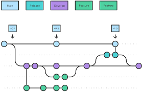

Consider that you are working on an essay for school. Initially, you will create a draft and save it in your system, now after completing the initial draft you made some changes like adding new information, deleting irrelevant information and correcting grammatical errors in the file. After making all these changes you will save the document using save as and save it as draft 2. You might be thinking why should I replace the draft one with the updated draft?

The reason might be that the verbose in the initial draft might be better or the information that you deleted might be important. So it's better to save the file as draft two.  Now consider it is a folder with multiple files, It becomes complex to store multiple drafts of all the files in the folder, Now consider that it's a group assignment and multiple people are working on the same files. Now it becomes even more complex.  After a while, it becomes hard to figure out which file contains what information and what changes were made.

Now let's correlate this example for software development. Similar to draft one and draft two, for every application launched, we have semantic versioning. A public API should be declared and the changes can be communicated to the API by incrementing the version number.  Semantic versioning contains three major indicators called Major, Minor and patch, represented as `Major.Minor.Patch`.  This number doesn't represent the size of the software or application.

Let's consider an initial release of a drone 1.0.0

It has some basic functionalities:


```
Move Up/Down (Throttle)
Tilt Forward/Backward (Pitch)
Move Left/Right ( Roll)
```


Everything looks fine but A Dorne itself is not worth more than a toy, to add some additional functionality a camera is added to the drone. 

Now the version is 1.1.0

```
Move Up/Down (Throttle)
Tilt Forward/Backward (Pitch)
Move Left/Right ( Roll)
Camera
```

This addition of the camera is a minor update because even without the camera the drone works but it's preferred to have a camera attached to the drone. Based on this example it can be concluded that the minor update brings a new feature which changes the API but is backwards compatible. To simply define, the minor update is a non-breakable change.

To improve the visibility and ease of image capturing a new movement should be added to rotate the drone left or right called Yaw. this upgradation is called a patch. Patch updates are interchangeable and consumers should update their software without hesitation. 


1.1.1

```
Move Up/Down (Throttle)
Tilt Forward/Backward (Pitch)
Move Left/Right ( Roll)
Camera
Rotate  Left/Right ( Roll )
```

Now consider that The purpose of the drone is changed and now the drone is used to spray pesticides instead of image capturing.

The new update is 2.0.0


```
Move Up/Down (Throttle)
Tilt Forward/Backward (Pitch)
Move Left/Right ( Roll)
Rotate  Left/Right ( Roll )
Camera
Storage tank and spray equipment.
```

The above update will change the software. The camera is removed and a new updated storage tank and spray equipment is added.
The major update will cause interface change and breaks the backward compatibility.


The above versioning applies to software development. As the number of updates grows, it becomes hard to classify and manage all the versions. On top of that the real-life development process includes collaboration. When multiple people work on the same project consisting of multiple files, it will lead to the following issues will arise:

1. Storage: All the files created for all changes will take up more storage.
2. Tracking: multiple changes made by multiple collaborators should be tracked.
3. Maintenance: The changes if not tested properly may break the application and if that happens the application must revert to its recent stable version.
4. Security: Not everyone should be allowed to make changes to the application.

To solve all the above problems and to add some additional functionalities version control system is used.

for aditional information refer [semver](https://semver.org/)

Version Control System:

Version control system are classified into two types, they are

Centralized
Distributed

Consider a scenario where one of your friends has a borad game and in order to lay that game, all the friends can access it from that specific friend. This is an example for centralized VCS and now consider that a group of friends are playing an online game. Insted of gathering at a single palce all the friends can connect and play from ther home. This is an example for dsistributed VCS.

To put it in technical terms, centralized VSC has a single central copy of project and programmers will access and commit their chnages form that copy. This arrangement is not prefered because if the central sever fails, the entire project fails. few examples for centralized VCS are  CVS Preforce and subversion.


In distributed VCS the codebase maintained in the server is coppied to every individual developers system. Even though a single user looses the data or a failure occurs in sungle system, the code is preserved. Few examples for distributed VCS are GIT and Mecurial.


for additional information refer [git version contol](https://git-scm.com/book/en/v2/Getting-Started-About-Version-Control)

GIT :

As explained GIT is  a free and opensource distributed version control system. It is used to handle small to larg projects with speed and efficiency.

To install GIT refere [git download](https://git-scm.com/downloads).

Once the installation procedure is completed, to check if GIT is installed in you system run the following command in the command prompt(windows) or terminal in caseof mac os or linix.

```
 git --version
```

If git is installed, the output  should be the git version installed in your system.

GIT can be accessed using command line, IDE and GUI.  In this documnt we will use commad line tool GIT bash and VisualStudioCode IDE (VS code)

To download VS code refer [VS Code Download](https://code.visualstudio.com/download)

Open Git bash. The following are the initial settings to be configured:

1. Name
2. Email
3. Default Editor 


### git config

Git config is used to configure the options line name, email etc.


Step 1: To configer the name run the following command with your user name

```
git config --global user.name "user name"
```

<i><b>Note: user name is entered in double quoate because user name may conatin space.  </b></i>

Step 2: To configer the email run the following command with your email.


```
git config --global user.email useremail
```


Step 3: core editor is the editor used to edit the configiration settings. When compared to git bash VS code better UI and its easy to use. To set VS Code as core editor run the following command in git bash.

```
git config --global core.editor "code  --wait"
```

- code is bin location of VS code saved in your system. `code` is configured in your system when VS code is installed.
- `--wait` ensures that no action can be performed in git bash when VS code is opened for editing the git files.

Step 4: To open the core edior run the following command

```
git config --gloabl -e
```

### Scopes

`--global` repsents the scope of git configuration. Git has following scopes:

1. `--global`: The configuration set using global scope sets the non-default beahviour for all the repositoris of a specific user.
2. `--system`: The configuration set using system scope sets the non-default beahviour for every user of the system and all their repositories.
3. `--local`: The configuration set using system scope sets the non-default beahviour for that specific repository.


### git help

If you get stuck anywhere in git or if you need any information about any git command `git help` provides detaild inofrmation of git commands. Run the following command

```
git command-name --help
```

To get the short description run the following command

```
git command-name --h
```

### Git bash workflow


**Local**: Local represents the files and folders in your local system.

**Staging:** Staging is an intermediate area between local files and repository. The staging are is used to check all the chnages made and only the necessay changes are commited to the repository.

**Repository:** GIT repository is the collection of all the files of projects of the versions. Local repository is th repository initialized in the local system. remote repository is the repository created in Git Hub, Git labs etc.

### Creating a Git repository

Step 1: Create a folder in your system dedicated to the git repository.

```
mkdir name
```

Step 2: navigate to that directory

```
cd directory-name
```

Step 3: To initialise the repository enter the following command.

```
git init
```

- Once the repository is initialised `.git` file is created and it contains all the important information like git objects, hooks, HEAD and logs etc.
- `.git` file should not edited because it might break the repository.
- Normally `.git` file is hidden to avoid editing.


### git add

Git add is used to add the the changes of working directory to the stagging area. The following command is run.

```
git add file name
```
To add multiple files that have same extention the following command is used

```
git add *.extention
```

the extention can be `txt` for text file, `java` for java files etc.

For recursively adding all changes of all files the following command is used

```
git add .
```

Its better to avoid `git add .` because a project contains files that are huge and its not suggested to reccursively add those files to the stagging area.
<br>
To remove files from the stagging area the following command is used.

```
git restore --staged file name
```

### git commit

Git commit is used to save the changes to the local repository. The following command is run to commit the changes

```
git commit -m "message"
```

Git commit contains the following information:

1. Id: A unique SHA1 value and it will be generated by automatically to uniquely identify the commit.
2. Message: The message entered to describe the changes
3. Data/time
4. Author: the user name and user email configured in git.
5. Complete snapshot of project


### .gitignore

Once git repository is initialises it tracks all the files. Even thought the files are not stagged they are tracked. Some files like user log files do not have to b tracked and added to stagging area. Those files can be added to `.gitignore`

To add a file to `.gitignore` enter the following command.

```
echo "file name">> .gitignore
```

<i><b>Note:</b> Once the files are stagged they will not be ignored if if they are added to <code>.gitignore</code>. the staged files should be unstaged to ignore.</i>

### git status

Git status give the state of the worning directory and the stagging area. Information about current branch, staged and unstages changes are displayed using git status. Run the following command

```
git status
```

To get short status run the following command

```
git status -s
```

### git diff

To view the changes made in working directory and stagging area `git diff` is used.

To view the stagged changes run the following command
```
git diff --staged
```

To view unstagged changes run the following command.

```
git diff
```

### git log

To get the history of all the commits `git log` is used. Run the folowing command to get the history

```
git log
```

to get oneline description of commits run the following command

```
git log --oneline
```

<i><b>Note</b> <code>git log</code> lists out the information of all the commits starting from the most recent commit. To get information in initial to teh most recent <code>git log --reverse</code> can be used.</i>

### Creating a remote repository

Create a git hub account using the link [git hub](https://github.com/).
Once the account is created, to create a new repository refer [git repositoty creation](https://docs.github.com/en/repositories/creating-and-managing-repositories/creating-a-new-repository)

### git clone

`git clone` is used to create a copy of existing repository. It can be a remote repository or a local repository. To create a copy of remote repository, copy the repository link(http or ssh) from remote repository and run the following command.

```
git clone repository-link
```

for addifitional information refer [git hub clone](https://docs.github.com/en/repositories/creating-and-managing-repositories/cloning-a-repository)

### remote add

`git remote add` command will create a new connection record to a remote repository.

the following command is run to add connect a remote git repository

```
git remote add origin repositoy-link
```

For additional information refer [git remote add](https://docs.github.com/en/get-started/getting-started-with-git/managing-remote-repositories)


### git fetch

git fetch is used to download the contents from remote repository.

```
git fetch
```

### git merge

git merge is used to merge the changes in remote repository to the local repository. git merge is alco used to integrate changes from another branch to current branch.

### git pull

git pull is combination of git fetch and git merge. All the remote changes are downloaded and merged with local repository. Incase of any conflicts git merge will not be implemented.

```
git pull
```

### git push

git push is used upload the local repository content to the remote repository. After commiting all the changes the following command is implemented to psush the chnages to the reomte repository.

```
git push
```

### git branch and git checkout

A branch is an independent line of development in git.



In every project there is a main/master branch. It is the initial branch crealted along with the git repository. In git work flow a develop or dev branch is used to protect the information in main branch. Along with main and dev branches feature branches are created by users to work on the project. Feature branches are branched from dev branches and all the changes made by feature branches are incorporated to the main branch via the dev branch but never directly to the main branch. 


To create a branch run the dollowing command

```
git branch branch-name
```

To create a dev branch `git branch dev` command is run. Feature branches are created from dev branch, to create a branch from a specific branch the following command is used.

```
git branch branch-name from-branch
```
To create feature branch `git branch feature dev` command is run.

`git checkout` is used to navigate between the git branches. The following command is used to checkout to a specific branch.

```
git checkout branch-name
```

For additional information about git commands refer [git commands](https://git-scm.com/docs)


